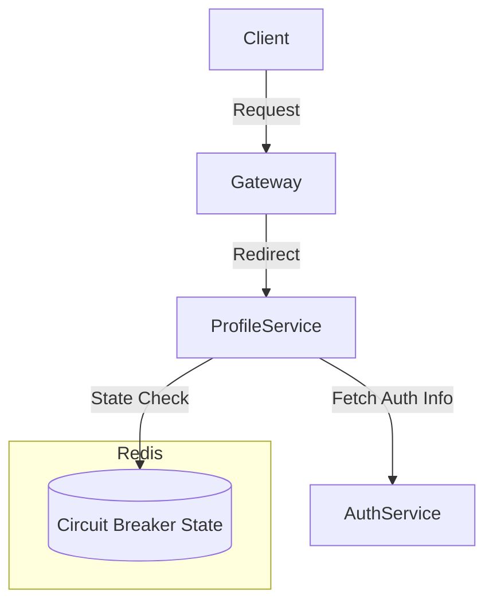

# Redis Circuit Breaker Example

> A minimal **distributed circuit breaker implementation** using **Redis**  
> Built for **service-to-service communication** with simple **gateway + microservices architecture**

---

## Architecture Overview



---

## Features

- Simple Gateway to route requests
- Two microservices: `AuthService` and `ProfileService`
- Circuit Breaker logic at `ProfileService` to manage `AuthService` calls
- Redis used for:
  - Shared state management (failures, open/close logic)
  - Distributed control across instances

---

## Circuit Breaker Flow

```
            .---------------------------.
            |  ProfileService          |
            |--------------------------|
Request --> | Is Circuit Open?         |
            |     |                    |
            |    No                    |
            |     ↓                    |
            | Call Auth Service        |
            |     |                    |
            |  Success?                |
            |     |                    |
            |    Yes ----------------> Return Response
            |     ↓
            |  Increment Failure Count
            |     |
            |  Threshold Reached?
            |     ↓
            |   Open Circuit (Redis)
            '---------------------------'
```

---

## Project Structure

```
.project-root
 ┣ /gateway
 ┃ ┗ index.js
 ┣ /auth-service
 ┃ ┗ auth.js
 ┣ /profile-service
 ┃ ┗ profile.js  <- Contains Circuit Breaker logic
 ┣ redis
 ┣ README.md
```

---

## Custom Logic

- The circuit breaker stores:
  - Failure count
  - Last failure timestamp
  - Cooldown duration
- These are used to determine:
  - When to retry
  - When to stop calling `AuthService`

Redis Keys:
```bash
cb:auth:state         // OPEN / CLOSED
cb:auth:failures      // Number of failed requests
cb:auth:lastFailure   // Timestamp of last failure
```

---

## Future Enhancements

- Auto-recovery based on success ratio
- Pluggable strategy for breaker logic
- adding correct fallback result

---

## Request Flow

```text
Request ---> Gateway ---> ProfileService ---❓---> AuthService
                                  |     ▲
                                  ▼     |
                             Circuit Breaker (Redis)
                                  |
                         [ OPEN 🔴 / CLOSED 🟢 ]
```

---

## Quick Start

```bash
# 1. Clone the repository
git clone https://github.com/your-username/redis-circuit-breaker.git
cd circuit-breaker-redis

# 2. Copy the environment file
cp .env.template .env

# 3. Install dependencies for each service
cd gateway && pnpm install
cd ../auth && pnpm install
cd ../profile && pnpm install

# 4. Start everything with Docker Compose
cd ..  # back to project root
docker-compose up
```

> Make sure Redis is running via Docker Compose.  
> You can modify Redis or service ports in `.env` as needed.


---

> **Tip**: This repo shows how you can **build your own Resilience Layer** without 3rd-party libraries using pure Node.js and Redis.

---

## License

MIT © 2025
